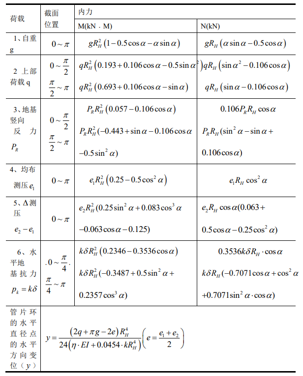

# 内力图生成

Excel使用惯用计算法及修订惯用计算法计算管片截面弯矩和轴力，用于绘制拱结构（或圆形截面）的弯矩图和轴力图。



## 依赖

```bash
pip install numpy matplotlib
```

## 数据格式

`data.txt` 中的每组数据由 `|||` 分隔。每组数据分为两部分，用 `---` 分隔：

```
弯矩值1
弯矩值2
...
---
轴力值1
轴力值2
...
|||
下一组弯矩值
...
```

- 上方数据：弯矩（kN·m），对应左半圆
- 下方数据：轴力（kN），对应右半圆

## 使用方法

处理 `data.txt` 中所有组数据，生成 `img/` 下的 SVG 文件：

```bash
python main.py
```

## 输出说明

- **左半圆**：弯矩图，数据点沿径向偏移，单位 kN·m
- **右半圆**：轴力图，数据点沿径向偏移，单位 kN
- 正值为外侧偏移（拉伸），负值为内侧偏移（压缩）
- 每隔 3 个数据点标注数值标签
